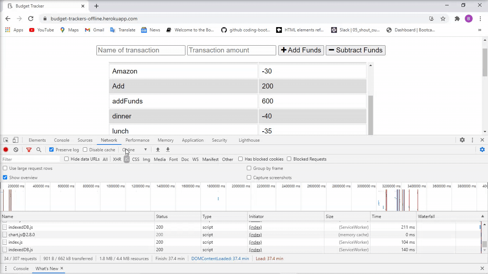
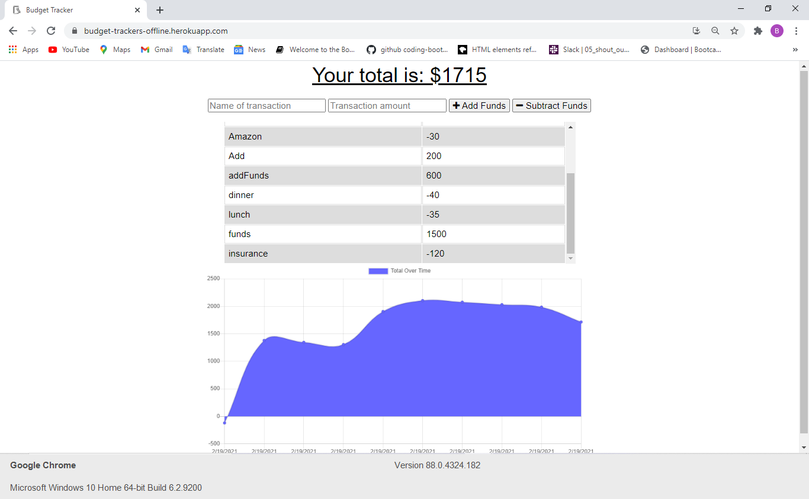

# Budget-Trackers

## Title:
Budget Trackers

## Table of Contents
  * [Description](#description)
  * [Installation](#installation)
  * [Questions](#questions)
  * [License](#license)

## Description

An app that allow the user to add expenses and deposits to their budget with or without a connection. When entering transactions offline, the user should populate the total when brought back online.

Here is the Github repository: https://github.com/decoste/Budget-Trackers

The Heruko deployed site: https://budget-trackers-offline.herokuapp.com/

The following GIF demonstrates the application functionality (when offline):

## Table of Contents
  * [Installation](#installation)
  * [Questions](#questions)
  * [License](#license)

## Installation
No installation needed.  Only click on the following Herohu link:

https://budget-trackers-offline.herokuapp.com/

## Questions
The following is my Github accounts:

-[decoste](https://github.com/decoste)

Please feel free to send us an email if you have any question(s):

aladecoste@gmail.com

## License
MIT license

Screenshot of the website:

